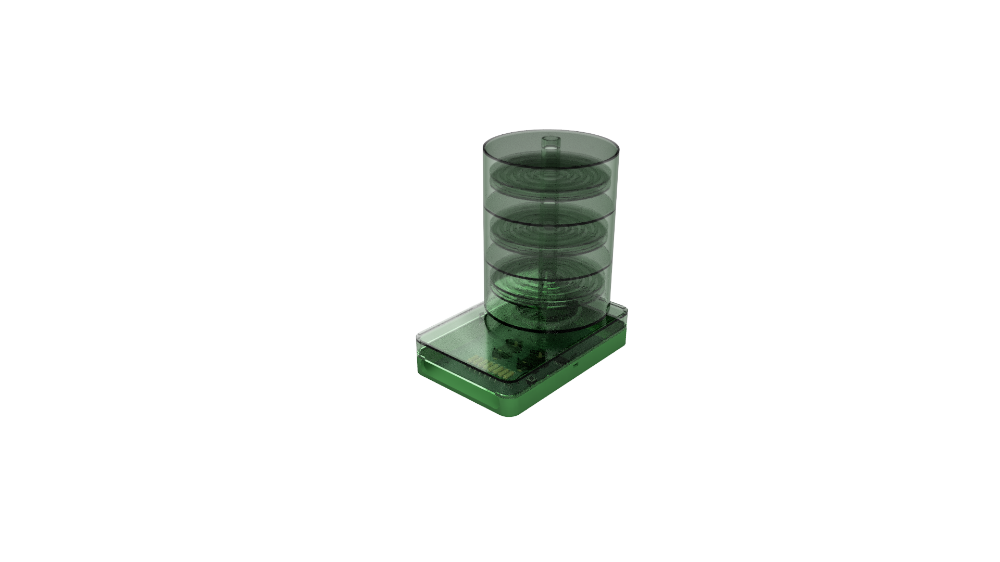
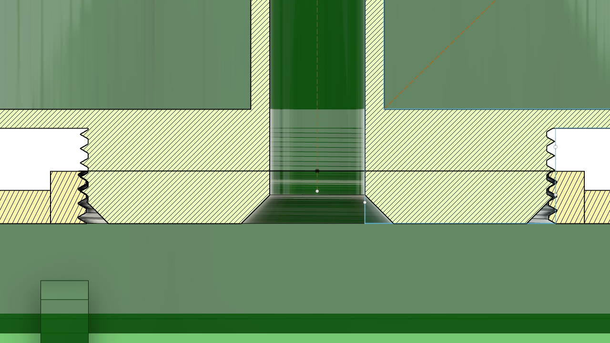
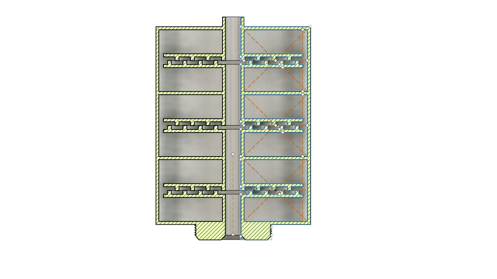
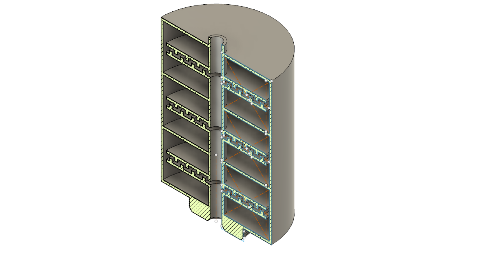
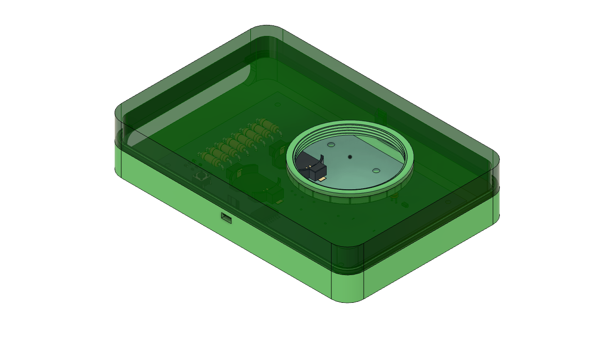
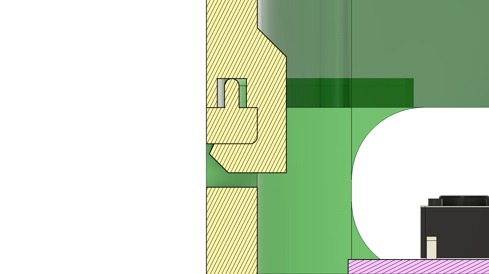

# Agila
## About this project
The Philippine Eagle is a majestic bird of prey and the pride of the Philippines. Unfortunately, it’s critically endangered with only less than 400 pairs in the wild. One of the difficulties of monitoring this species is the trek through miles of thick and humid rainforest. Now, imagine doing this task remotely, where an array of devices can be stuck to trees, enabling researchers can pinpoint the location of these endangered birds through a web/mobile application.

## Design
##### Overview
Collection of data is possible through microphones in the device; and directional information is not necessary as the intensity of the bird call is most important. The identification of the bird sound is done through machine learning. Furthermore, the communication between the devices to a central processing server/device shall be done with an RF or Satellite Module.

##### Application
A map of the area of interest shall be displayed with hotspots (KDE) of the likeliness of an endangered species of bird being present which is represented by a single color (monitoring of a single bird species) or multiple colors (monitoring of multiple bird species). Information shall be aggregated by time intervals; with tabs showing the information obtained by hour?, by day, by week, or more.

##### Machine Learning Model
I didn't create the model, so I can only give a high-level description; however, in essence, the model is used to identify the presence and classification of the bird species.

##### IoT Device
The electronics involved include—but not limited to—a satellite or RF module, a GPS module, a microcontroller, a high-fidelity, and finally an edge computing device for distilled ML models.

##### Housing
The device was housed in a 3d-printed case.

It's made up of two components—the 'camera lens', and the 'shell'. The lens was attached to the shell through a threaded design. This modular design was built with sustainability as the ideal while future-proofing for a multi-species iteration.

##### Lens

On the other hand, the lens itself is an application of acoustic metamaterials—a Helmholtz resonator.

*Cross-Section of the Lens*

*Isometric View of the Lens*

This design was from a paper by Sun et al. (2024). It was specifically chosen for its property to attenuate frequencies that are lower than a Philippines Eagle's acoustic signature to improve the quality of the recording without further computational complexity.

##### Casing
Meanwhile, the casing, which housed the PCB, was split halfway through and incorporated a cantilever snap-fit design.

*Cantilever Design*

## References
1. Sun, X., Yu, T., Wang, L., Lu, Y., & Chen, C. (2024). Embedded Rough-Neck Helmholtz Resonator Low-Frequency Acoustic Attenuator. _Crystals_, _15_(1), 12. [https://doi.org/10.3390/cryst15010012](https://doi.org/10.3390/cryst15010012)