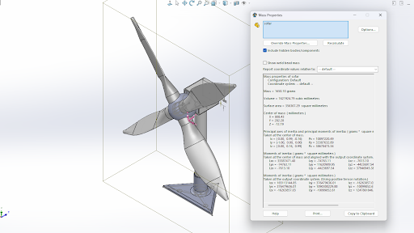

# Table Top Wind Turbine
## About this project
This was our final project for `ME 2105L`. We were tasked to implement Computed Aided Manufacturing techniques in order to design, develop, and analyze the cost of a product. Among a catalogue of product ideas, our group decided to work on a table top wind turbine design. My task was to design and simulate plastic mold injection.

## Design

### Overview
The turbine's architecture is built on a modular assembly of 3D-printed parts and standard electronic hardware, allowing for easy maintenance and portability.

- Modular Stability: The design features a triangular base to maximize surface coverage while optimizing desk space. Fillets were added to the base and stem to enhance structural stability.

- Aerodynamic Efficiency: It utilizes a three-blade horizontal axis configuration with high-solidity airfoil profiles to maximize torque at low wind speeds.

- Integrated Protection: A conical nose cone diverts airflow smoothly around the generator housing, reducing turbulence and drag.

### Plastic Mold Simulation <Badge type="danger" text="SOLIDWORKS" />
TBA...
