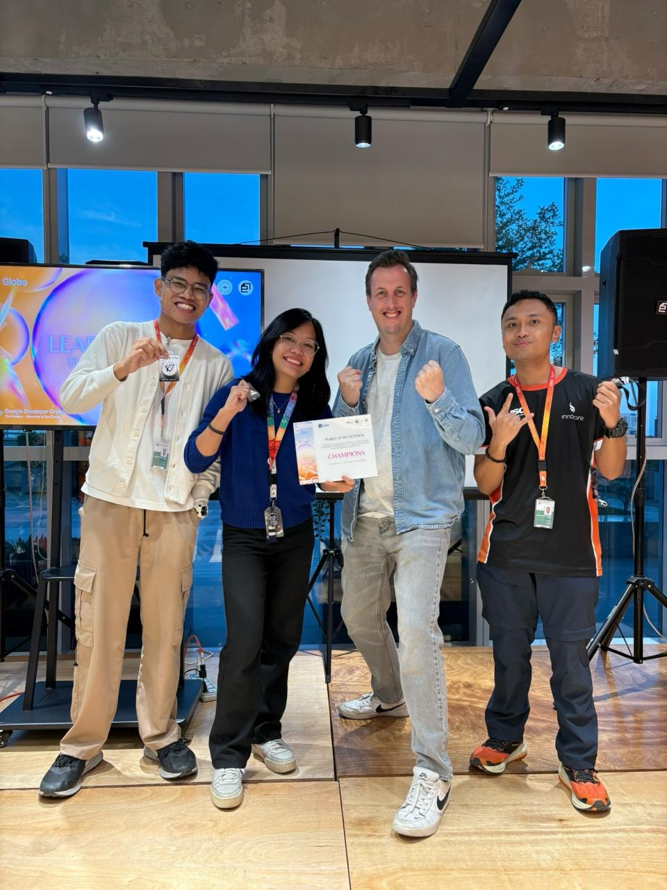
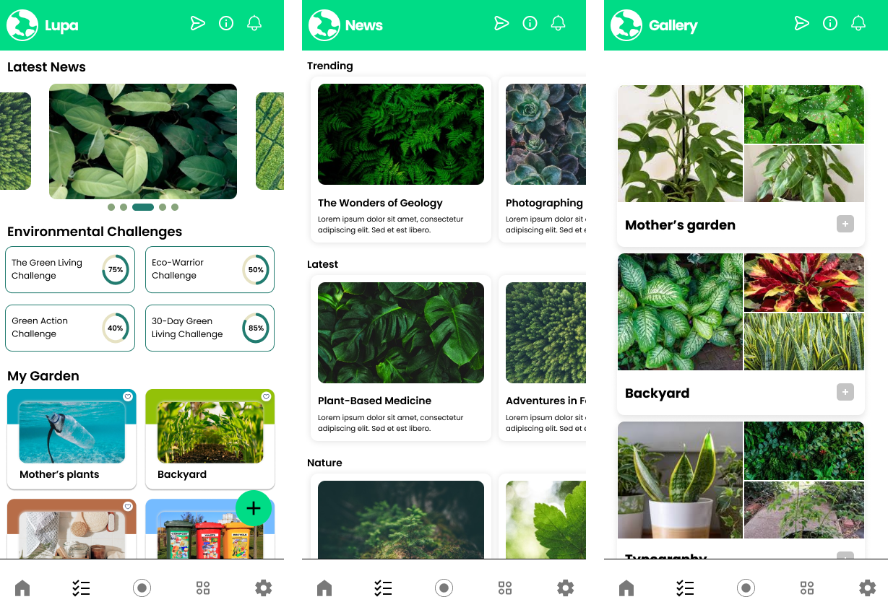
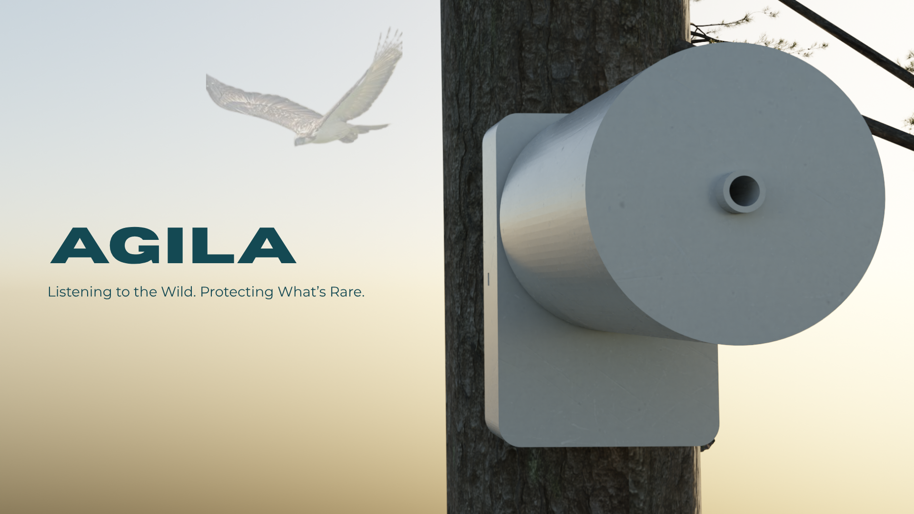

# Competitions

## 2024

### Philippine Junior Data Science Challenge

Our team built a flood prediction model through a Random Forest Classifier, utilizing UMAP to transform the data for dimensionality reduction.
Geospatial data was obtained from NASA, then preprocessed to obtain 1st and 2nd derivative features. This model was used to generate data for a jeepney rerouting algorithm.
A Monte Carlo simulation was performed to compare existing path-finding algorithms with Metro Manila's OSM graph.

##### Comprehensive Description
Our entry was a comprehensive flood prediction and jeepney route rerouting system designed for Metro Manila, Philippines. The system integrates multiple data sources including the AEGIS flood dataset, NOAH flood hazard maps (5-year, 25-year, and 100-year return periods), NASA GPM precipitation data, and ECMWF weather forecasts to predict flooding events and dynamically reroute jeepney transportation networks. The core of the system employs machine learning models, specifically a Random Forest classifier combined with UMAP dimensionality reduction, to predict flood-prone areas based on spatial features such as latitude, longitude, precipitation levels, elevation data from digital elevation models (DEM), and historical flood hazard classifications. The transportation network is modeled using graph theory with NetworkX and OSMnx, representing jeepney routes as nodes and edges that can be disrupted when flooding is predicted. When nodes are identified as flooded through the prediction model, the system automatically calculates alternative routes by finding shortest paths between disconnected network segments, ensuring continuous transportation service even during adverse weather conditions. The project includes comprehensive data processing pipelines for precipitation data conversion, spatial interpolation techniques including kriging, Monte Carlo simulations for uncertainty quantification, and visualization tools for flood prediction maps and route analysis. The system is designed to operate in near-real-time, retrieving weather forecast data and generating updated route recommendations as conditions change, making it a practical tool for improving urban transportation resilience in flood-prone metropolitan areas.

## 2025

### National Python Programmming Competition

##### Description
The national python programming competition was a competitive programming competition hosted by DLSU-D.
Initially, I only joined the junior category, which was intended for freshmen and sophomores (at that time, I was a freshman). However, neither the junior nor senior category have enough participants so they merged the two categories, pitting me against 3rd and 4th year students. I had thought this was going to be a fun experiment of testing my skills; now, it had become a challenging endeavour. So, armed with 4 days of practice by (mostly) reading a book on competitive programming and zero hours of leetcode, it was full steam ahead for the day of the competition.

However, the night before, I had doubts. When the number of participants were revealed and the list of participating universities became a board of intimidation: UP-LB, DLSU, ADMU, Adamson—I wanted to quit. Thankfully, my best friend told me that I should just take this as a learning experience. Personally I knew I was not going to bag a place, given the reputation of the schools that participated. Yet, in my stubborn and competitive mindset, I shrugged away my doubts and took it as a challenge.

Color me surprise when I got 4th place.

::: info Footnote
I skipped a lab class for this.
:::

### Learniverse: The Ideathon

**Learniverse: The Ideathon** was a cebu-wide Ideathon joined by undergraduates from big universities in Cebu. Participants were only given 90 minutes to generate a solution to novel problems in the Philippines.
Our team pitched 'Lupa'—a Strava-like mobile journaling application for plant lovers. Revenue was to be generated through an in-app marketplace with 80% donated to non-profits.

### James Dyson Award

##### Description

The James Dyson Award is an annual engineering competition hosted by Dyson®. 

["... is an international design award that celebrates, encourages and inspires the next generation of design engineers."](https://www.jamesdysonaward.org/home/#:~:text=The%20James%20Dyson%20Award%20is%20an%20international%20design%20award%20that%20celebrates%2C%20encourages%20and%20inspires%20the%20next%20generation%20of%20design%20engineers.)
Our team—consisting of two computer science students, a computer engineering student, and me—hoped to bag the national award by presenting our solution on bird preservation.

::: info
More information can be found [here](../engineering/dyson).
:::
